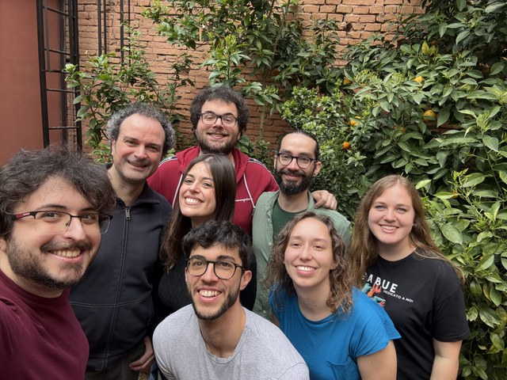

# Language Technologies Lab

## Welcome

We are a research group of the Department of Computer Science and Engineering of the University of Bologna. 
Our focus is natural language processing research and application. 
We contribute to several national and international research projects and offer a variety of NLP learning activities at the international masters degree in Artificial Intelligence and elsewhere.

## Research

### Argument Mining

#### Argumentative Fallacies 

The detection and classification of argumentative fallacies.
Fallacy constitute an important aspect of argumentation because they require substantial reasoning capabilities to be spotted, thus, representing a valuable challenge for machine learning models. 

#### Multimodality 

We have worked in evaluating the combination of audio and text modalities.
Does audio modality provide any benefit in addressing argument mining tasks? 

#### Dialogues 

We have developed a benchmark for argumentative dialogues on scientific papers.
Nonetheless, nowadays the focus is more on developing commercial tools rather than on developing benchmarks. 

#### Interpretability 

The development of interpretable models for argumentation.
A current focus is on extracting local explanations from texts to acquire insights about data.
For instance, which kind of patterns are associated with certain argumentative components? 

#### Reasoning in LLMs 

LLMs and reasoning are hot topics that are currently vastly being investigated.
Though, there are still few attempts that aim to use argumentation as a resource for assessing reasoning in LLMs. 

### Legal Analytics

#### Argumentation and Argument Schema 

We have defined legal arguments and developed benchmarks for training machine learning in automatically identifying them.
Legal arguments are relevant to several legal tasks (e.g., judgement prediction) as they encode important decisions and opinions that are tailored to a given problem.
Moreover, legal experts are interested in assessing if there are some recurring patterns concerning legal arguments.
For instance, do similar documents convey similar legal arguments?
Can we compare documents based on their arguments? 

#### Judgement Prediction 

The automatic prediction of the judge's decision.
We have developed benchmarks and assessed standard and transformer-based models on this task. 

#### Interpretability 

We have explored memory-augmented neural networks and decision trees to define more interpretable models, encouraging user trustworthiness based on explanations in addition to model efficiency. 

#### Unfair Clause Detection 

The automatic  identification and classification of unfair clauses.
We have developed benchmarks on this topic. 

#### Summarization 

Can machine learning models summarize legal documents based on certain guidelines?
Are the developed summaries useful to legal experts? 

#### Cross-linguality

We have developed some methods to project labels from similar documents written in different languages. 

#### Information Retrieval 

The automatic retrieval of legal documents and knowledge based on a similarity metric.
This also link to the argumentation topic if we use arguments (either quantitatively or qualitatively) to compare and rank retrieved documents. 

### Speech

#### Argumentation 

We have investigated argumentation task using audio features.
We have also developed a toolkit to foster research on this topic. 

#### Clinical domain 

We have defined a taxonomy of best practices for curating and maintaining clinical datasets for audio modality.
We are currently evaluating interpretable speech techniques on clinical data (e.g., depression). 

#### Interpretability 

The development of interpretable audio features to address downstream task.
An example is audio tokens, a discretization process to better analyze audio inputs. 

#### Multimodality 

We have explored text and audio modalities to assess their overall and individual contribution.
We have mainly target argumentation tasks for now.

## Useful Links

- [LT Lab Website](https://site.unibo.it/nlp/en) $\rightarrow$ The official LT Lab website.
- [MARGOT](http://margot.disi.unibo.it/) $\rightarrow$ Our tool for mining arguments from text (online web demo).
- [MAMKit](https://nlp-unibo.github.io/mamkit/) $\rightarrow$ Our toolkit for multimodal argument mining.
- [CLAUDETTE](http://claudette.eui.eu/index.html) $\rightarrow$ Our tool for analysing consumer contracts and privacy policies.
 
## Template

This github.io page has been built via [al-folio](https://github.com/alshedivat/al-folio) academic template.

